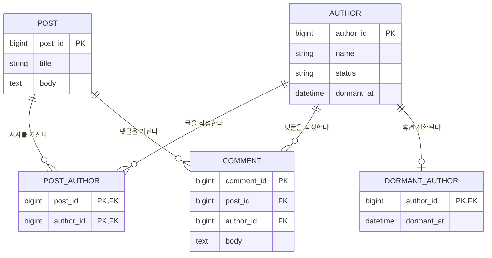

# 관계형 데이터 모델링

## 한눈에 보기

관계형 데이터 모델링은 현실 세계의 업무 규칙을 데이터 구조로 옮기는 과정이다. 수업에서는 다음 순서로 학습했다.

```text
업무 파악 → 개념적 데이터 모델링 → 논리적 데이터 모델링 → 물리적 데이터 모델링
```

- **업무 파악**: 요구사항에서 관리할 대상과 규칙을 찾는다.
- **개념적 모델링**: 엔티티, 속성, 관계와 업무 규칙을 ERD로 표현한다.
- **논리적 모델링**: 관계형 모델에 맞게 테이블, 키, 관계를 구체화하고 정규화한다.
- **물리적 모델링**: 사용할 DBMS에 맞춰 자료형, 인덱스, 제약 조건과 저장 구조를 정한다.

좋은 개념 모델은 이후 단계를 안내하지만, 논리·물리 모델링까지 완전히 기계적으로 결정하지는 않는다. 키 선택, 다대다 관계 해소, 정규화 수준, 성능을 위한 인덱스 같은 설계 판단이 남는다.

## 왜 필요한가

- 구현 전에 업무 용어와 규칙을 시각적으로 합의할 수 있다.
- 누락된 대상, 모호한 관계, 잘못된 필수 조건을 조기에 찾을 수 있다.
- JPA 엔티티와 DB 테이블을 만들기 전에 관계의 방향과 다중성을 구분할 수 있다.

## 핵심 개념

### ERD의 구성 요소

수업에서 사용한 Chen 표기법에서는 엔티티를 사각형, 관계를 마름모, 속성을 타원으로 나타낸다. 표기법에 따라 모양은 달라질 수 있으며 Crow's Foot 표기법은 엔티티 안에 속성을 나열하고 선 끝의 기호로 관계를 표현한다.

| 구성 요소 | 뜻 | 논리·물리 모델에서 흔한 구현 |
| --- | --- | --- |
| 엔티티(Entity) | 독립적으로 관리할 사람, 사물, 사건, 개념 | 테이블 |
| 속성(Attribute) | 엔티티가 가지는 성질 | 컬럼 |
| 관계(Relationship) | 엔티티 사이의 업무상 연관 | 외래 키 또는 연결 테이블 |

관계 자체가 곧 PK나 FK가 되는 것은 아니다. 예를 들어 1:N 관계는 보통 N 쪽의 외래 키로, M:N 관계는 두 엔티티를 참조하는 연결 테이블로 구현한다. 연결 테이블의 PK는 두 FK의 복합 키일 수도 있고 별도 대체 키일 수도 있다.

### Cardinality와 Optionality

- **Cardinality(대응 수)**: 한 엔티티 인스턴스가 상대 엔티티의 몇 개 인스턴스와 연결될 수 있는지 나타낸다. 대표적으로 1:1, 1:N, M:N이 있다.
- **Optionality(선택성 또는 최소 참여 수)**: 관계 참여가 필수인지 나타낸다. 최소값 `0`은 선택, `1`은 필수다.

두 개념을 최소·최대 표기로 함께 적으면 의미가 분명해진다.

| 표기 | 뜻 |
| --- | --- |
| `0..1` | 없거나 하나 |
| `1..1` | 정확히 하나 |
| `0..N` | 없거나 여러 개 |
| `1..N` | 하나 이상 |

예를 들어 `글 1 — 댓글 0..N`은 글 하나에 댓글이 없을 수도 있고 여러 개일 수도 있다는 뜻이다. 반대 방향이 `댓글 N — 글 1`이고 댓글이 반드시 글에 속해야 한다면, 댓글에서 글로의 참여는 `1..1`이다. 논리 모델에서는 보통 `comment.post_id NOT NULL` 외래 키로 이 필수성을 구현한다.

### 식별자와 키

| 용어 | 의미 |
| --- | --- |
| 슈퍼키(Super key) | 행을 유일하게 식별할 수 있는 하나 이상의 속성 집합. 불필요한 속성을 포함할 수 있다. |
| 후보키(Candidate key) | 불필요한 속성을 제거해 더 줄일 수 없는 최소 슈퍼키 |
| 기본키(Primary key) | 여러 후보키 중 대표 식별자로 선택한 키 |
| 대체키(Alternate key) | 후보키이지만 기본키로 선택되지 않은 키 |
| 외래키(Foreign key) | 다른 테이블의 기본키나 고유 키를 참조하여 참조 무결성을 유지하는 키 |
| 복합키(Composite key) | 둘 이상의 컬럼으로 구성된 키 |

수업 메모의 `중복키`는 표준적으로 널리 합의된 식별자 분류인지 확인되지 않았다. 문맥상 `슈퍼키` 또는 `복합키`를 가리켰을 가능성이 있으므로 원본 표현은 보존하되 검증 전에는 별도 개념으로 단정하지 않는다.

업무에 이미 존재하는 값을 쓰는 **자연키**와 `id`처럼 시스템이 부여하는 **대체 식별자(surrogate key)** 중 무엇이 항상 우선하는 것은 아니다.

- 자연키는 업무 의미가 분명하지만 값이 바뀌거나 길고 복합적일 수 있다.
- 대체 식별자는 짧고 안정적이지만 업무상 유일성은 별도의 `UNIQUE` 제약으로 지켜야 한다.
- `AUTO_INCREMENT`는 대체 식별자를 생성하는 DBMS별 방법 중 하나이지 대체키 그 자체의 정의는 아니다.

## 동작 원리

### 수업 도메인에서 엔티티 찾기

요구사항은 다음과 같다.

- 저자는 글을 작성할 수 있다.
- 글은 여러 저자가 작성할 수 있다.
- 글에는 댓글을 작성할 수 있다.
- 저자는 휴면 계정으로 전환될 수 있다.

여기서 `저자`, `글`, `댓글`은 독립적으로 식별하고 관리할 데이터가 있으므로 엔티티 후보가 된다. 저자와 글은 M:N 관계이므로 관계형 모델에서는 `글_저자` 연결 엔티티가 필요하다. 댓글 작성자가 저자인지는 요구사항에 없으므로 연결을 추정하지 않는다. 휴면 여부만 필요하다면 저자의 `status` 또는 `dormant_at` 속성으로 표현할 수 있지만, 전환 이력을 관리해야 한다면 별도 이력 엔티티가 필요할 수 있다.

### 첨부 ERD 판독


첨부 그림에는 `저자`, `휴면자`, `글`, `댓글` 네 엔티티가 있다.

| 엔티티 | 그림에 표시된 속성 |
| --- | --- |
| 저자 | 저자 아이디, 이름, 자기소개, 가입일 |
| 휴면자 | 휴면일 |
| 글 | 글 아이디, 제목, 작성일, 본문 |
| 댓글 | 댓글 아이디, 작성일, 본문 |

관계와 끝점 기호는 다음과 같이 읽을 수 있다.

- **저자–글 `작성`**: 글 하나에는 저자가 한 명 이상 연결되고, 저자는 글을 작성하지 않거나 여러 글을 작성할 수 있는 M:N 관계로 표현되어 있다. 논리 모델에서는 연결 테이블로 해소한다.
- **글–댓글 `소속`**: 댓글은 글 하나에 속하고, 글에는 댓글이 없거나 여러 개 있을 수 있는 1:N 관계로 표현되어 있다.
- **저자–휴면자**: 저자 한 명이 휴면자가 아니거나 하나의 휴면자 정보만 가질 수 있는 1:0..1 구조로 읽힌다. 휴면자의 저자 정보는 정확히 하나다.
- **저자–댓글 `작성`**: 그림의 끝점 기호만으로는 불명확했지만, 후속 수업 메모에서 저자 한 명은 댓글 여러 개를 작성할 수 있고 댓글 하나는 저자 한 명이 작성하는 1:N 관계로 확인했다.

따라서 첨부 ERD는 앞서 도출한 저자–글 M:N 및 글–댓글 1:N 구조와 일치한다. 차이점은 첨부 ERD가 `휴면자`를 별도 엔티티로 두고 저자–댓글 1:N 작성 관계도 포함한다는 것이다. `휴면자` 분리는 휴면 전환에 독립적인 속성이나 생명주기가 있을 때 유용하다. 휴면일 하나만 관리한다면 저자의 상태와 `dormant_at` 속성으로 단순화할 수도 있다.



이 그림은 요구사항을 관계형 구조로 옮긴 하나의 예시이며 유일한 정답은 아니다. 특히 다음 규칙이 정해지면 모델이 달라진다.

- 글에는 저자가 반드시 한 명 이상 있어야 하는가?
- 저자는 글을 한 편도 쓰지 않을 수 있는가?
- 댓글은 반드시 글 하나에 속하는가?
- 댓글 작성자도 관리하는가? 익명 댓글이 가능한가?
- 휴면 전환 이력과 사유를 보존해야 하는가?

## 예제

### 1:1 관계: 저자와 휴면자

업무 규칙을 최소·최대 수로 쓰면 다음과 같다.

- 저자에서 휴면자 방향: `0..1` — 저자는 휴면자가 아닐 수도 있고, 휴면자라면 하나의 휴면 정보만 가진다.
- 휴면자에서 저자 방향: `1..1` — 휴면자 레코드는 반드시 저자 한 명에 대응한다.

이 도메인에서는 `휴면자`가 `저자` 없이 존재할 수 없으므로 휴면자 쪽에 FK를 두는 편이 자연스럽다. 가장 단순한 구현은 저자의 PK를 휴면자의 PK이자 FK로 함께 사용하는 **공유 기본키(shared primary key)** 방식이다.

```sql
CREATE TABLE dormant_author (
    author_id  BIGINT PRIMARY KEY,
    dormant_at TIMESTAMP NOT NULL,
    FOREIGN KEY (author_id) REFERENCES author(author_id)
);
```

- FK는 존재하지 않는 저자를 참조하지 못하게 한다.
- `PRIMARY KEY`는 `author_id`의 중복과 `NULL`을 막으므로 저자 한 명당 휴면자 레코드가 최대 하나만 생긴다.
- 저자 테이블에는 휴면자 FK가 없으므로 휴면자가 아닌 저자도 `NULL` 컬럼 없이 저장할 수 있다.

휴면자에 별도 `dormant_author_id`를 둔다면 `author_id BIGINT NOT NULL UNIQUE`가 필요하다. **FK만 두면 동일한 저자를 가리키는 휴면자 행이 여러 개 생길 수 있으므로 1:1이 아니라 1:N이 될 수 있다.**

FK를 어느 쪽에 두는지는 단순히 “의존하는 쪽”이라는 한 문장만으로 항상 결정되지는 않는다. 양쪽의 optionality, 생명주기, `NULL` 허용 여부, 관계가 가지는 속성을 함께 본다. 다만 이 사례에서는 휴면자의 필수 참여와 저자에 대한 존재 의존성 때문에 휴면자 쪽이 적합하다.

### 1:N 관계: 글·댓글과 저자·댓글

1:N은 보통 N 쪽 테이블에 1 쪽의 FK를 둔다. 댓글 하나는 글 하나와 저자 한 명에 대응하지만, 글이나 저자는 댓글 여러 개에 대응할 수 있기 때문이다.

```sql
CREATE TABLE comment (
    comment_id BIGINT PRIMARY KEY,
    post_id    BIGINT NOT NULL,
    author_id  BIGINT NOT NULL,
    body       TEXT NOT NULL,
    created_at TIMESTAMP NOT NULL,
    FOREIGN KEY (post_id) REFERENCES post(post_id),
    FOREIGN KEY (author_id) REFERENCES author(author_id)
);
```

1 쪽인 저자 테이블에 `comment_id_1`, `comment_id_2` 같은 반복 컬럼을 두거나 한 컬럼에 댓글 ID 여러 개를 저장하면 댓글 수에 따라 스키마가 바뀌고 1NF도 위반한다. N 쪽인 댓글에 `author_id` 하나를 두면 각 댓글의 작성자를 한 값으로 표현할 수 있다. 댓글이 반드시 글과 저자를 가져야 한다는 수업 규칙은 `NOT NULL`로 구현한다. 익명 댓글을 허용하는 요구사항이라면 `author_id`의 선택성 및 NULL 정책을 다시 결정해야 한다.

### M:N 관계를 연결 테이블로 변환

```sql
CREATE TABLE post_author (
    post_id   BIGINT NOT NULL,
    author_id BIGINT NOT NULL,
    PRIMARY KEY (post_id, author_id),
    FOREIGN KEY (post_id) REFERENCES post(post_id),
    FOREIGN KEY (author_id) REFERENCES author(author_id)
);
```

`(post_id, author_id)`의 복합 기본키는 같은 저자가 같은 글에 중복 연결되는 것을 막는다. 저자의 역할이나 표시 순서처럼 관계 자체의 속성이 생기면 `post_author`에 컬럼을 추가할 수 있다.

예를 들어 저자 1과 저자 2가 글 10을 공동 작성했다면 연결 테이블에는 다음 두 행이 생긴다.

| post_id | author_id | 의미 |
| ---: | ---: | --- |
| 10 | 1 | 저자 1이 글 10을 작성했다. |
| 10 | 2 | 저자 2가 글 10을 작성했다. |

각 행은 “한 저자가 한 글을 작성했다”라는 관계의 한 인스턴스다. 한 컬럼에 `1,2`처럼 여러 ID를 넣지 않으므로 각 값은 원자적이고, 두 FK를 통해 양쪽 엔티티의 존재도 검증할 수 있다. 이 테이블은 mapping table 외에도 **연결 테이블**, **junction table**, **association table**이라고 부른다.

## 주의사항

- 엔티티를 무조건 명사마다 만들지 말고 독립 식별, 속성, 생명주기, 관계 속성의 필요성을 확인한다.
- ERD 표기법마다 모양과 필수 참여 표현이 다르므로 사용한 표기법을 명시한다.
- 개념 모델에서 DBMS 구현 세부사항을 너무 일찍 확정하지 않는다. 다만 업무상 식별자 후보는 이 단계부터 찾는다.
- 개념 모델에 정답이 하나뿐인 것은 아니지만, 요구사항을 만족하는지와 관계형 무결성을 유지하는지는 검증할 수 있다.

## 관련 개념

- [데이터베이스 정규화](./%EB%8D%B0%EC%9D%B4%ED%84%B0%EB%B2%A0%EC%9D%B4%EC%8A%A4%20%EC%A0%95%EA%B7%9C%ED%99%94.md)
- [JPA 일대다 다대일 연관관계](../spring/JPA%20%EC%9D%BC%EB%8C%80%EB%8B%A4%20%EB%8B%A4%EB%8C%80%EC%9D%BC%20%EC%97%B0%EA%B4%80%EA%B4%80%EA%B3%84.md)

## 검증 필요

- `휴면자`를 별도 엔티티로 유지할지는 휴면일 외의 속성, 전환 이력, 독립적인 생명주기를 관리하는지에 따라 결정해야 한다.
- `중복키`가 수업에서 어떤 정의로 사용되었는지 원 강의 구간 확인이 필요하다.

## 추가 학습

- [생활코딩 관계형 데이터 모델링](https://www.opentutorials.org/course/3883) — 개념 모델을 논리·물리 모델로 변환하는 후속 강의까지 학습한다.
- 공유 기본키 방식과 `UNIQUE` FK 방식으로 저자–휴면자 1:1 테이블을 각각 만들고 허용·거부되는 데이터를 비교한다.
- `POST_AUTHOR`에 저자 역할과 표시 순서를 추가해 관계 자체가 속성을 가지는 경우를 모델링한다.
- 익명 댓글 허용 여부에 따라 `COMMENT.author_id`의 optionality와 `NULL` 정책이 어떻게 달라지는지 비교한다.
