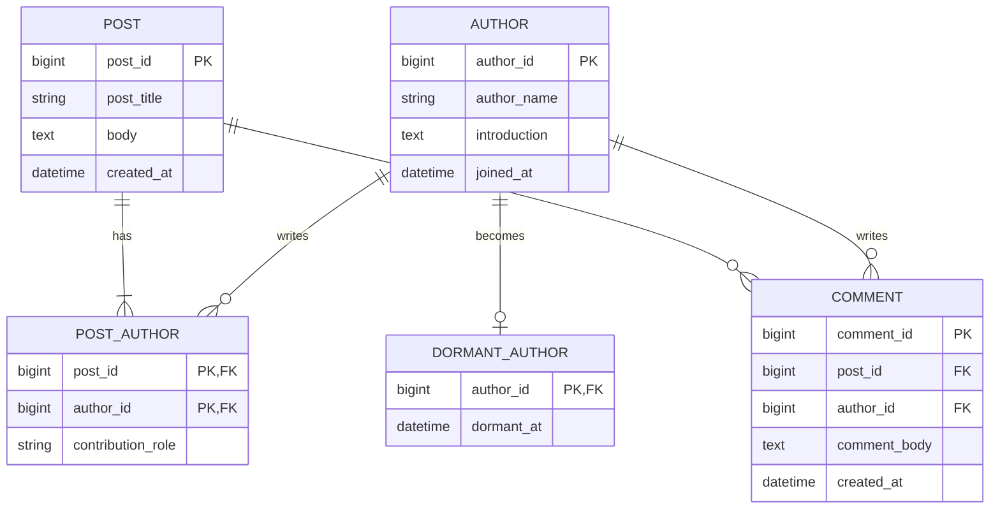

# 데이터베이스 정규화

## 한눈에 보기

정규화는 데이터 중복과 삽입·갱신·삭제 이상을 줄이도록 테이블을 분해하고 데이터 종속성을 정리하는 과정이다.

정규형은 누적된다. 2NF 테이블은 먼저 1NF를 만족해야 하고, 3NF 테이블은 1NF와 2NF를 모두 만족해야 한다.

| 단계 | 핵심 조건 | 제거하려는 문제 |
| --- | --- | --- |
| 제1정규형(1NF) | 한 칸에 하나의 값만 두고 반복 속성 묶음을 제거한다. | 다중 값과 반복 컬럼 |
| 제2정규형(2NF) | 1NF를 만족하고, 일반 속성이 복합 후보키의 일부에만 의존하지 않는다. | 부분 함수 종속 |
| 제3정규형(3NF) | 2NF를 만족하고, 일반 속성이 다른 일반 속성을 거쳐 키에 의존하지 않는다. | 이행 함수 종속 |

## 왜 필요한가

중복된 사실을 여러 행에 저장하면 다음 이상(anomaly)이 발생할 수 있다.

- **삽입 이상**: 글이 아직 없는 저자를 등록하려면 글 정보까지 억지로 입력해야 한다.
- **갱신 이상**: 여러 행에 반복된 저자 이름 중 일부만 수정되어 값이 불일치한다.
- **삭제 이상**: 저자의 마지막 글 관계를 삭제했더니 저자 정보까지 함께 사라진다.

정규화는 하나의 사실을 가능한 한 한 곳에서 관리하도록 테이블을 분해하고 PK와 FK로 다시 연결한다.

## 핵심 개념

### 함수 종속

`X → Y`는 X 값이 정해지면 Y 값이 하나로 결정된다는 뜻이다. 예를 들어 `author_id → author_name`은 같은 저자 ID가 언제나 같은 저자 이름을 가리킨다는 업무 규칙이다.

- **완전 함수 종속**: Y가 복합 키 전체에 의존하며 키의 일부만으로는 결정되지 않는다.
- **부분 함수 종속**: Y가 복합 키의 일부만으로 결정된다.
- **이행 함수 종속**: `X → Y`, `Y → Z`를 통해 `X → Z`가 간접적으로 성립한다.

정규화는 기본키 하나만 보는 작업이 아니다. 모든 후보키와 실제 업무의 함수 종속을 기준으로 판단해야 한다.

## 예제: 저자·글·댓글을 3NF까지 정리하기

아래 예시는 정규화 과정을 설명하기 위해 수업 도메인을 확장한 것이다. `공동 작성 역할`은 관계 자체의 속성을 보여주기 위한 예시이며 사용자가 실제 요구사항으로 제시한 것은 아니다.

### 정규화 전

한 글의 여러 저자와 여러 댓글을 한 행에 넣으면 다음과 같은 구조가 될 수 있다.

| post_id | post_title | author_ids | author_names | comment_ids |
| ---: | --- | --- | --- | --- |
| 10 | 관계형 모델링 | `1, 2` | `김저자, 이저자` | `100, 101` |

`author_ids`, `author_names`, `comment_ids` 한 칸에 여러 값이 들어가므로 저자나 댓글 하나를 독립적으로 조회·수정하기 어렵다.

### 제1정규형: 한 칸에 하나의 값

반복되는 저자와 댓글을 행 단위로 펼쳐 두 관계로 분리한다.

`POST_AUTHOR_FLAT`

| post_id | author_id | post_title | author_name | contribution_role |
| ---: | ---: | --- | --- | --- |
| 10 | 1 | 관계형 모델링 | 김저자 | 대표 |
| 10 | 2 | 관계형 모델링 | 이저자 | 공동 |

기본키는 `(post_id, author_id)`다. 각 칸은 하나의 값만 가지므로 1NF를 만족하지만, 글 제목과 저자 이름이 관계 행마다 반복된다.

`COMMENT_FLAT`

| comment_id | post_id | post_title | author_id | author_name | comment_body |
| ---: | ---: | --- | ---: | --- | --- |
| 100 | 10 | 관계형 모델링 | 1 | 김저자 | 좋은 글입니다. |
| 101 | 10 | 관계형 모델링 | 2 | 이저자 | 예제가 이해됩니다. |

### 제2정규형: 부분 함수 종속 제거

`POST_AUTHOR_FLAT`에는 다음 함수 종속이 있다.

```text
post_id → post_title
author_id → author_name
(post_id, author_id) → contribution_role
```

`post_title`은 복합키 중 `post_id`에만, `author_name`은 `author_id`에만 의존한다. 이 부분 함수 종속을 제거해 다음처럼 분리한다.

```text
POST(post_id PK, post_title, body, created_at)
AUTHOR(author_id PK, author_name, introduction, joined_at)
POST_AUTHOR(post_id PK/FK, author_id PK/FK, contribution_role)
```

`POST_AUTHOR.contribution_role`은 “특정 저자가 특정 글에서 맡은 역할”이므로 복합키 전체에 의존한다. 관계 속성이 없다면 `POST_AUTHOR`에는 두 FK만 있어도 된다.

단일 컬럼 기본키인 `COMMENT_FLAT.comment_id`에는 키의 일부가 없으므로 부분 함수 종속도 없다. 따라서 이 관계는 2NF를 만족할 수 있지만 아직 3NF를 위반할 수 있다.

### 제3정규형: 이행 함수 종속 제거

`COMMENT_FLAT`에는 다음 종속이 있다.

```text
comment_id → post_id, author_id, comment_body
post_id → post_title
author_id → author_name
```

따라서 `comment_id → post_id → post_title`, `comment_id → author_id → author_name`이라는 이행 함수 종속이 생긴다. 댓글 테이블에서 글 제목과 저자 이름을 제거하고 FK만 남긴다.

```text
COMMENT(
  comment_id PK,
  post_id FK,
  author_id FK,
  comment_body,
  created_at
)
```

글 제목은 `POST`, 저자 이름은 `AUTHOR`에서 한 번만 관리하고 필요할 때 JOIN으로 조회한다. 이제 글 제목이나 저자 이름을 변경해도 댓글 행들을 함께 수정할 필요가 없다.

## 3NF 결과



`DORMANT_AUTHOR.author_id`는 `AUTHOR`를 참조하는 PK이자 FK이므로 저자 한 명당 최대 하나의 휴면 정보만 허용한다. 이 1:1 제약은 정규화와 별개로 cardinality와 optionality를 물리 스키마에 구현한 것이다.

## 주의사항

- M:N 관계를 연결 테이블로 바꾸는 것은 관계형 논리 모델로 매핑하는 과정이며, 이를 정규화와 완전히 같은 개념으로 보지는 않는다. 결과 구조가 정규형을 만족하는지는 함수 종속으로 별도 검증한다.
- 2NF는 복합 후보키가 있을 때 특히 의미가 드러난다. 기본키가 단일 컬럼이라고 해서 자동으로 3NF까지 만족하는 것은 아니다.
- 3NF는 중복을 줄이지만 조회 시 JOIN이 늘 수 있다. 성능 때문에 중복을 의도적으로 도입하는 반정규화는 측정과 무결성 유지 전략을 전제로 한다.
- 이름처럼 변경 가능한 값 대신 안정적인 식별자를 FK로 사용한다.

## 관련 개념

- [관계형 데이터 모델링](./%EA%B4%80%EA%B3%84%ED%98%95%20%EB%8D%B0%EC%9D%B4%ED%84%B0%20%EB%AA%A8%EB%8D%B8%EB%A7%81.md)
- 기본 키와 후보 키
- 외래 키
- 함수 종속
- [JPA 일대다 다대일 연관관계](../spring/JPA%20%EC%9D%BC%EB%8C%80%EB%8B%A4%20%EB%8B%A4%EB%8C%80%EC%9D%BC%20%EC%97%B0%EA%B4%80%EA%B4%80%EA%B3%84.md)

## 검증 필요

- 1NF부터 3NF까지의 설명과 예제는 사용자 요청에 따라 외부 자료로 보완한 내용이다. 생활코딩 강의에서 사용하는 용어와 예제는 영상 시청 후 대조한다.
- `contribution_role`은 함수 종속을 설명하기 위해 추가한 가상 속성이며 실제 수업 도메인의 요구사항이 아니다.

## 추가 학습

- [데이터베이스 정규화 연습문제](./%EB%8D%B0%EC%9D%B4%ED%84%B0%EB%B2%A0%EC%9D%B4%EC%8A%A4%20%EC%A0%95%EA%B7%9C%ED%99%94%20%EC%97%B0%EC%8A%B5%EB%AC%B8%EC%A0%9C.md) — 온라인 강의 수강 신청 테이블을 1NF부터 3NF까지 직접 분해한다.
- [생활코딩 관계형 데이터 모델링](https://www.opentutorials.org/course/3883) — 논리적 모델링과 제1·2·3정규화 강의를 순서대로 학습한다.
- [생활코딩 제1정규화 영상](https://www.youtube.com/watch?v=FYDHJbIwm5Y) — 다중 값과 반복 속성을 행과 테이블로 분리하는 과정을 복습한다.
- 정규화 전 예제에서 삽입·갱신·삭제 이상을 각각 한 가지씩 직접 만든다.
- `POST_AUTHOR_FLAT`의 함수 종속을 적은 뒤 2NF 테이블로 직접 분해한다.
- 3NF 결과를 JOIN해 정규화 전 조회 결과를 복원하는 SQL을 작성한다.
